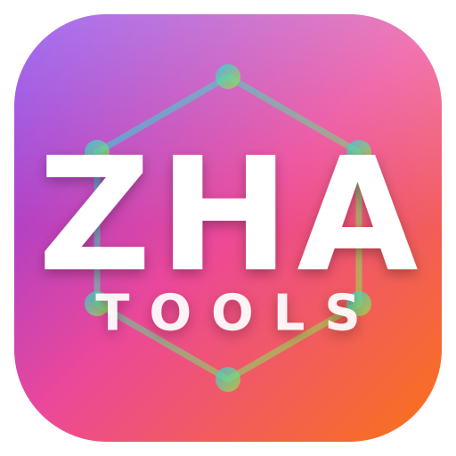

# ZHA Tools

<p align="center">
  
</p>

<p align="center">
  <a href="https://github.com/egenix/zha-tools/actions/workflows/ci.yml"></a>
  <a href="https://hacs.xyz"></a>
</p>

ZHA Tools is a [Home Assistant](https://www.home-assistant.io/) custom integration that provides a growing collection of small **helper actions** for working with [ZHA](https://www.home-assistant.io/integrations/zha/) (Zigbee Home Automation) devices from your automations and scripts.

Each helper is a self-contained action in the `zha_tools.` namespace that does one job and reports a clear result. The integration is built to be extended: new helpers can be added alongside the existing ones without changing how they are installed or used.

The helpers recover flaky Zigbee devices on a schedule, or in response to an event, without anyone having to walk over to the device — which matters because installed devices often have their pairing button buried behind a wall plate, ceiling fitting or enclosure.

## Helpers

| Helper | Action | What it does | Risk |
| --- | --- | --- | --- |
| [Reconfigure](#reconfigure) | `zha_tools.reconfigure` | Run a ZHA device reconfigure (re-run binding and reporting setup) with automatic retries. | Safe |
| [Re-interview](#re-interview) | `zha_tools.reinterview` | Re-interview a device in place (rediscover its endpoints and clusters) with automatic retries. The device never leaves the network. | Safe |
| [Rejoin](#rejoin) | `zha_tools.rejoin` | Ask a device to leave and immediately rejoin — a remote substitute for the pairing button. | ⚠️ Dangerous |

All three actions report a status back to the caller and use `SupportsResponse.ONLY`, so a call **must** capture the response with `response_variable` (see [Troubleshooting](#troubleshooting)).

Reconfigure and re-interview also run on [all devices](#running-on-all-devices) at once, instead of on a single one.

More helpers will be added to this list over time.

## Requirements

- Home Assistant **2025.8.0** or newer.
- The ZHA integration must already be set up, with the device(s) you want to work with paired and managed by ZHA.

## Installation

### HACS (recommended)

1. In HACS, add `https://github.com/egenix/zha-tools` as a custom repository with the category **Integration**.
2. Install the **ZHA Tools** integration from HACS.
3. Restart Home Assistant.
4. Add the integration via **Settings -> Devices & Services -> Add Integration**, then search for **ZHA Tools**.

### Manual

1. Copy the `custom_components/zha_tools` directory into your Home Assistant `config/custom_components/` directory.
2. Restart Home Assistant.
3. Add the integration via **Settings -> Devices & Services -> Add Integration**, then search for **ZHA Tools**.

The integration is set up entirely from the UI via Home Assistant's config and options flows; each helper's defaults (where it has any) are edited under **Settings -> Devices & Services -> ZHA Tools -> Configure**.

## Reconfigure

The `zha_tools.reconfigure` action triggers a ZHA device reconfigure for a single device — or for [all devices](#running-on-all-devices) — and reports the outcome back to the caller.

- Runs the reconfigure from automations and scripts, the same operation as the "Reconfigure device" button in the ZHA UI.
- Automatically retries when the reconfigure does not complete cleanly.
- Configurable per-attempt timeout, maximum number of retries, and delay between attempts — set sensible defaults once and override them per call.
- Returns structured response data (`device_id`, `status`, `attempts`) so automations can react to the outcome.

### Defaults

The reconfigure defaults are edited via **Settings -> Devices & Services -> ZHA Tools -> Configure**:

- **timeout** (default `20`) — the per-attempt timeout, in seconds. A single reconfigure attempt that does not finish within this time is reported as a `timeout` and (if retries remain) retried.
- **max_retries** (default `10`) — the maximum number of retries *after* the first attempt. The total number of attempts is therefore up to `max_retries + 1`. A retry happens whenever the status is anything other than `complete`.
- **retry_delay** (default `5`) — the number of seconds to wait between attempts.

Each of these defaults can be overridden on a per-call basis by passing the corresponding field to the action.

### Fields

| Field | Required | Default | Description |
| --- | --- | --- | --- |
| `device_id` | yes, unless `all_devices` is used | — | The ZHA device to reconfigure. The UI presents a device selector filtered to the `zha` integration. |
| `all_devices` | no | `false` | Reconfigure every ZHA device except the coordinator, one after another. Cannot be combined with `device_id`. See [Running on all devices](#running-on-all-devices). |
| `timeout` | no | configured default (`20`) | Per-attempt timeout, in seconds. |
| `max_retries` | no | configured default (`10`) | Maximum number of retries after the first attempt (total attempts up to `max_retries + 1`). |
| `retry_delay` | no | configured default (`5`) | Seconds to wait between attempts. |

### Response

The action uses `SupportsResponse.ONLY`, which means it **only** returns response data. Automations **must** capture the result with `response_variable`, and any blocking caller must request the response (for example, `return_response: true`).

The response is a mapping with the following keys:

- `device_id` (string) — the ID of the device that was reconfigured.
- `status` (string) — one of:
  - `complete` — the reconfigure finished and at least one binding and at least one reporting configuration step were reported back as successful (a flaky device where only some clusters succeed still counts).
  - `incomplete` — the reconfigure finished, but it did not get at least one successful binding and one successful reporting step.
  - `timeout` — an attempt did not finish within the timeout.
  - `unavailable` — the device did not respond / is offline.
- `attempts` (integer) — the number of attempts that were made.

### Example: automation

This automation reconfigures a device every night and sends a notification with the result.

```yaml
alias: Nightly reconfigure of the kitchen sensor
triggers:
  - trigger: time
    at: "03:00:00"
actions:
  - action: zha_tools.reconfigure
    data:
      device_id: 1234567890abcdef1234567890abcdef
      timeout: 15
      max_retries: 5
      retry_delay: 10
    response_variable: result
  - if:
      - condition: template
        value_template: "{{ result.status == 'complete' }}"
    then:
      - action: notify.mobile_app_phone
        data:
          title: ZHA Tools
          message: "Device reconfigured successfully after {{ result.attempts }} attempt(s)."
    else:
      - action: notify.mobile_app_phone
        data:
          title: ZHA Tools reconfigure failed
          message: "Reconfigure ended with status '{{ result.status }}' after {{ result.attempts }} attempt(s)."
```

### Example: script / Developer Tools

You can also call the action directly from a script, or from **Developer Tools -> Actions** (Perform action). When calling it programmatically, request the response so you can read the result.

```yaml
sequence:
  - action: zha_tools.reconfigure
    data:
      device_id: 1234567890abcdef1234567890abcdef
    response_variable: result
  - action: system_log.write
    data:
      level: info
      message: "Reconfigure status={{ result.status }} attempts={{ result.attempts }}"
```

In **Developer Tools -> Actions**, select `zha_tools.reconfigure`, pick the device, and enable "return response" to see the `device_id`, `status`, and `attempts` returned by the call.

### How it works

When the action is called, it triggers a ZHA device reconfigure for the selected device and watches ZHA's progress events for the device — in particular the binding and configure-reporting steps. Based on those events it decides the outcome: `complete` when at least one binding and at least one reporting step succeeded, `incomplete` when the run finished without that minimum success, `timeout` when an attempt did not finish in time, and `unavailable` when the device did not respond. If the result is anything other than `complete`, the action waits `retry_delay` seconds and tries again, up to `max_retries` additional attempts, then returns the final status and the number of attempts made.

### Troubleshooting

#### `Script requires 'response_variable' for response data for service call zha_tools.reconfigure`

This is expected, not a bug. The action is a [response-only](https://www.home-assistant.io/docs/scripts/service-calls/#use-templates-to-handle-response-data) action (`SupportsResponse.ONLY`): its sole job is to return the reconfigure result, so Home Assistant refuses to run it unless the caller captures that result. You called it without capturing the response.

Add `response_variable` to the action:

```yaml
  - action: zha_tools.reconfigure
    data:
      device_id: 1234567890abcdef1234567890abcdef
    response_variable: result        # <-- required
```

From **Developer Tools -> Actions**, enable the **Return response** toggle for the same reason. See [Response](#response) above for the keys returned in `result`. The same applies to the `reinterview` and `rejoin` actions below.

## Re-interview

`zha_tools.reinterview` re-interviews a device **in place**: it re-runs ZHA's device interview — rediscovering the node descriptor, endpoints and clusters — behind a shadow device, and swaps the refreshed device in on success. The device is **never removed from the network**, so this is safe; it cannot strand a device whose pairing button you can't reach. Use it when a device was interviewed badly (missing entities, wrong model, half-working) and a [reconfigure](#reconfigure) is not enough. It shares the reconfigure timeout/retry defaults and per-call overrides.

### Fields

| Field | Required | Default | Description |
| --- | --- | --- | --- |
| `device_id` | yes, unless `all_devices` is used | — | The ZHA device to re-interview. |
| `all_devices` | no | `false` | Re-interview every ZHA device except the coordinator, one after another. Cannot be combined with `device_id`. See [Running on all devices](#running-on-all-devices). |
| `timeout` | no | configured default (`20`) | Per-attempt timeout, in seconds. |
| `max_retries` | no | configured default (`10`) | Maximum number of retries after the first attempt. |
| `retry_delay` | no | configured default (`5`) | Seconds to wait between attempts. |

### Response

The response is a mapping with `device_id`, `status` — one of `complete` (the re-interview finished), `timeout` (an attempt did not finish in time), or `unavailable` (the device did not respond) — and `attempts`. An unexpected error during the re-interview is **not** swallowed: it propagates to the caller rather than being reported as a status.

### Example

```yaml
- action: zha_tools.reinterview
  data:
    device_id: 1234567890abcdef1234567890abcdef
  response_variable: result
```

## Running on all devices

[Reconfigure](#reconfigure) and [re-interview](#re-interview) can work through your whole Zigbee network in one call. Pass `all_devices: true` instead of a `device_id`:

```yaml
- action: zha_tools.reconfigure
  data:
    all_devices: true
  response_variable: result
```

What happens:

- Every device ZHA manages is processed, **except the coordinator** — that is the radio itself, not a device that can be reconfigured or re-interviewed.
- Devices are handled **one at a time**, in a predictable order (sorted by device name). The next device is only started once the previous one has finished — including all of its retries.
- The run **always continues** with the next device, whatever the previous one reported: a `timeout`, an `unavailable` device or even an unexpected error does not stop it.
- The timeout and retry fields apply *per device*, exactly as they do for a single-device call.
- `device_id` and `all_devices` are mutually exclusive; passing both is a validation error.

> [!NOTE]
> A batch run can take a long time: the worst case is roughly `number of devices x (max_retries + 1) x (timeout + retry_delay)`. With the defaults and a handful of unreachable devices, that is easily tens of minutes. Consider lowering `max_retries` for scheduled all-device runs.

### Only one at a time

While a batched reconfigure or re-interview is running, **no second batched run may start** — neither of the same action nor of the other one. Two batches talking to the same Zigbee network in parallel would only make the radio traffic (and the results) worse. A second batched call fails immediately with an error saying which run is still in progress; single-device calls are not affected.

### Response

The response for an all-devices run is a mapping with:

- `devices` (list) — one entry per device, in the order they were processed. Each entry is the same mapping a single-device call returns (`device_id`, `status`, `attempts`), except when the action raised an unexpected error for that device: then the entry has `status: error` and an `error` key with the error message (the full traceback is written to the log).
- `total` (integer) — the number of devices processed.
- `complete` (integer) — how many of them ended with status `complete`.
- `failed` (integer) — how many did not, that is `total - complete`.

For example, to notify only when something did not work out:

```yaml
- action: zha_tools.reinterview
  data:
    all_devices: true
    max_retries: 2
  response_variable: result
- if:
    - condition: template
      value_template: "{{ result.failed > 0 }}"
  then:
    - action: notify.mobile_app_phone
      data:
        title: ZHA Tools
        message: >-
          {{ result.failed }} of {{ result.total }} devices did not complete:
          {{ result.devices | rejectattr('status', 'eq', 'complete')
             | map(attribute='device_id') | join(', ') }}
```

## Rejoin

> [!CAUTION]
> **This can permanently drop a device from your network.** `zha_tools.rejoin` asks the device to *leave* the Zigbee network and immediately rejoin it — a ZDO leave request with the rejoin flag set, which is a remote substitute for pressing the pairing button. If the device's firmware does **not** honour the rejoin flag, it leaves and **does not come back**, and you will then have to re-pair it manually — exactly the situation you were trying to avoid. Mains-powered Zigbee 3.0 devices usually rejoin reliably; older or battery-powered (sleepy) devices are hit-or-miss. **Try [re-interview](#re-interview) first**, and only reach for rejoin when that is not enough.

For safety, the rejoin **requires an explicit `confirm: true`** (it refuses to run otherwise), is **never retried** (a second leave would only make things worse), and is **only sent to a device that is currently reachable**. It is deliberately **single-device only**: there is no `all_devices` option, because a batched rejoin could drop your entire network at once.

### Fields

| Field | Required | Default | Description |
| --- | --- | --- | --- |
| `device_id` | yes | — | The ZHA device to ask to leave and rejoin. |
| `confirm` | yes | — (no default) | Safety acknowledgement. Must be set to `true` for the action to run; it refuses otherwise, so a mistyped automation cannot trigger a rejoin by accident. |
| `rejoin_wait` | no | `60` | Seconds to wait for the device to return before reporting. `0` returns immediately after sending the request, without checking the outcome. |

### Response

The response is a mapping with `device_id` and `status` — one of:

- `unavailable` — the device was offline, so no leave was sent;
- `requested` — the leave-with-rejoin was sent, but the device has not been confirmed back (it may still be rejoining, or it may be gone);
- `complete` — the device was reachable again within `rejoin_wait`.

Because a rejoin cannot be confirmed reliably, treat `requested` as "asked, outcome unknown": follow up by checking the device, and keep physical access in mind in case a manual re-pair turns out to be necessary.

### Example

```yaml
- action: zha_tools.rejoin
  data:
    device_id: 1234567890abcdef1234567890abcdef
    confirm: true            # required; the action refuses to run without it
    rejoin_wait: 60
  response_variable: result
```

## Development

This project uses [uv](https://docs.astral.sh/uv/) for dependency management and tooling, and targets Python 3.13.

- `make test` — run the test suite.
- `make dist` — build a distribution zip into the `dist/` directory.

You need `uv` installed; see the [uv documentation](https://docs.astral.sh/uv/) for installation instructions.

### Releasing

Releases are published by pushing a `v`-prefixed tag. The release workflow (`.github/workflows/release.yml`) then builds the distribution zip and creates the GitHub release, using the matching `CHANGELOG.md` section as the release notes.

To cut a release:

1. Bump the version, keeping it identical in `custom_components/zha_tools/manifest.json`, `pyproject.toml`, `custom_components/zha_tools/__init__.py` and the `Makefile` (`make validate` checks that the first three agree).
2. Add a `## [x.y.z] - YYYY-MM-DD` section to `CHANGELOG.md` describing the changes, together with its `[x.y.z]:` link reference at the bottom of the file.
3. Commit the changes and push them to `main`.
4. Tag that commit and push the tag, which triggers the release:

```bash
git tag -a vX.Y.Z -m "ZHA Tools X.Y.Z"
git push origin vX.Y.Z
```

The tag must point at a commit that already contains the release workflow, because a tag-triggered workflow runs as the workflow exists at the tagged commit.

## Logo and branding

[`icons/logo.svg`](icons/logo.svg) is the editable source of the logo, and [`icons/logo-dark.svg`](icons/logo-dark.svg) is the dark-theme variant (a deeper gradient with a light edge ring). The PNGs they are rendered to — `icon.png` 256×256, `icon@2x.png` 512×512, `logo.png` / `logo@2x.png`, and the matching `dark_*` variants — live in [`custom_components/zha_tools/brand/`](custom_components/zha_tools/brand/) so they ship with the integration. `make validate` checks the icon dimensions.

The assets are generated by [`tools/make_logo.py`](tools/make_logo.py); run `make logo` to rebuild the dark variant and all brand PNGs from the SVG sources (add `--wordmark` to also re-bake the wordmark from a font).

Since **Home Assistant 2026.3.0**, a custom integration serves its own brand images directly from this `brand/` subdirectory — Home Assistant prefers them over the brands CDN, with no `manifest.json` changes required (see the [Brands Proxy API announcement](https://developers.home-assistant.io/blog/2026/02/24/brands-proxy-api)). So the logo appears in the UI as soon as the integration is installed; there is no need to submit it to the [home-assistant/brands](https://github.com/home-assistant/brands) repository. (On Home Assistant older than 2026.3.0 the local images are ignored and a brands-repository submission would be required instead.)

## License

Copyright 2026 eGenix.com Software, Skills and Services GmbH, Langenfeld, Germany.

Licensed under the Apache License, Version 2.0 (Apache-2.0). See [LICENSE.md](LICENSE.md) for the full license text.
